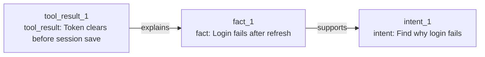

StateWeave graph state can be visualized as nodes and edges.

```ts
import { graphToMermaid } from "stateweave";

const mermaid = graphToMermaid(result.graph);
console.log(mermaid);
```

Example output:



In the CLI:

```bash
pnpm cli "Find why login fails after token refresh." --graph
```

Or toggle it interactively:

```txt
/graph
```

This keeps visualization dependency-free. A future UI can render the same `StateGraph` with any graph library.
